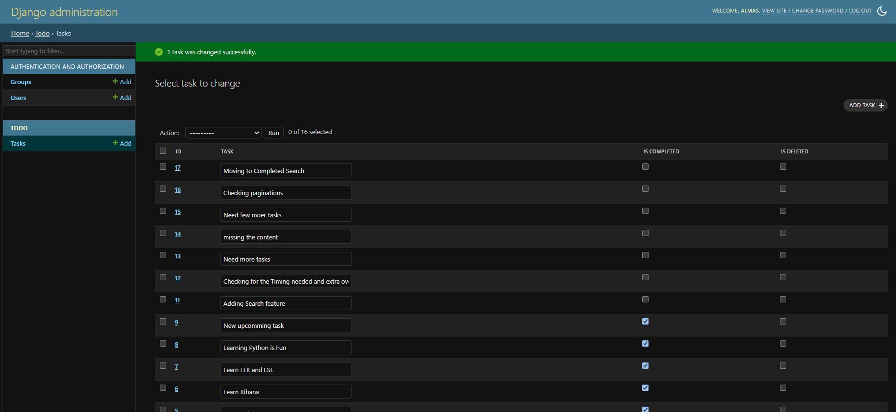
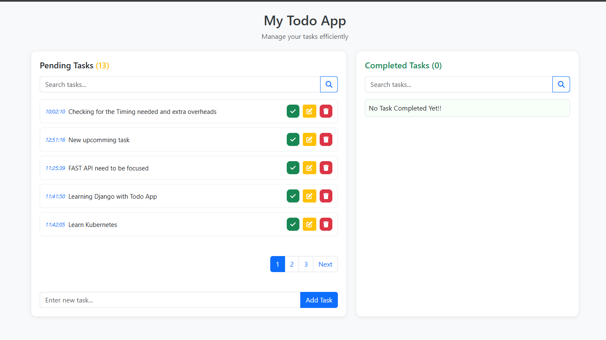
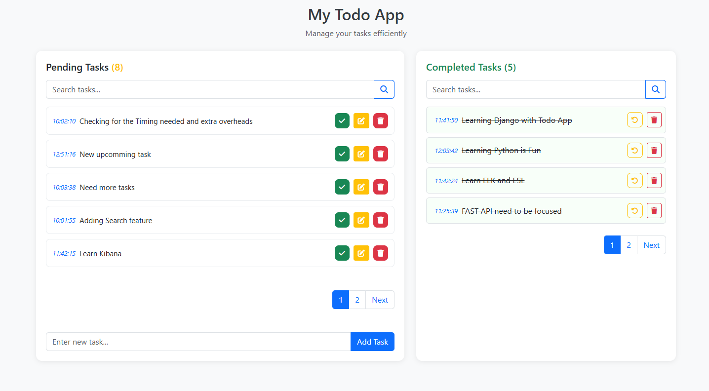
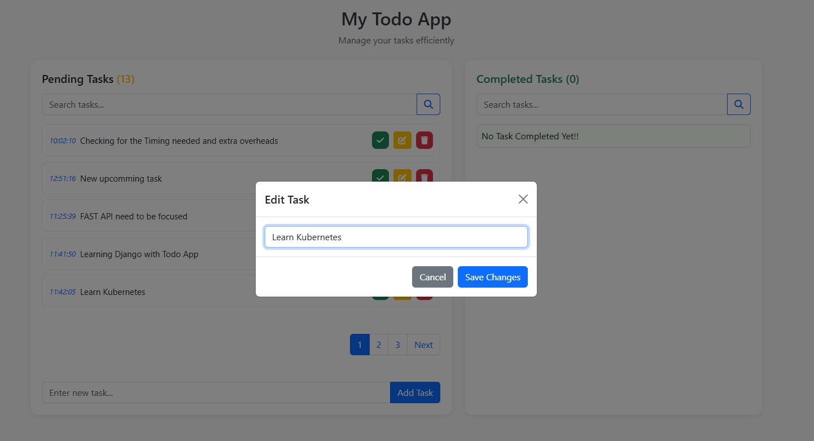

# Django Todo App

A simple and responsive Todo application built using Django and Bootstrap 5.

## Features

* Add new tasks
* Edit existing tasks
* Delete tasks
* Mark tasks as completed
* Restore completed tasks
* Search pending tasks
* Search completed tasks
* Independent pagination for pending and completed task lists
* Responsive Bootstrap UI
* Django Admin support
* Task validation to prevent empty submissions

## Screenshots




### Pending Tasks

* View all active tasks
* Search tasks
* Edit or complete tasks

### Completed Tasks

* View completed tasks
* Search completed tasks
* Restore tasks to pending status

## Technology Stack

* Python 3.x
* Django
* SQLite
* Bootstrap 5
* Font Awesome

## Installation

### Clone Repository

```bash
git clone <repository-url>
cd todo-app
```

### Create Virtual Environment

```bash
python -m venv venv
```

### Activate Virtual Environment

Windows:

```bash
venv\Scripts\activate
```

Linux / Mac:

```bash
source venv/bin/activate
```

### Install Dependencies

```bash
pip install -r requirements.txt
```

### Apply Migrations

```bash
python manage.py migrate
```

### Create Superuser

```bash
python manage.py createsuperuser
```

### Run Development Server

```bash
python manage.py runserver
```

Open your browser and navigate to:

```text
http://127.0.0.1:8000/
```

## Admin Panel

Access Django Admin:

```text
http://127.0.0.1:8000/admin/
```

Login using the superuser credentials created earlier.

## Project Structure

```text
todo-app/
│
├── manage.py
├── requirements.txt
├── .gitignore
│
├── todo/
│   ├── settings.py
│   ├── urls.py
│   ├── wsgi.py
│   └── asgi.py
│
├── todo_main/
│   ├── models.py
│   ├── views.py
│   ├── admin.py
│   ├── urls.py
│   └── migrations/
│
├── templates/
│   └── home.html
│
├── static/
└── media/
```

## Future Enhancements

* User authentication
* Task categories
* Due dates and reminders
* Task priorities
* REST API integration
* AJAX/HTMX live search
* Dark mode support

## License

This project is intended for learning and personal development purposes.
